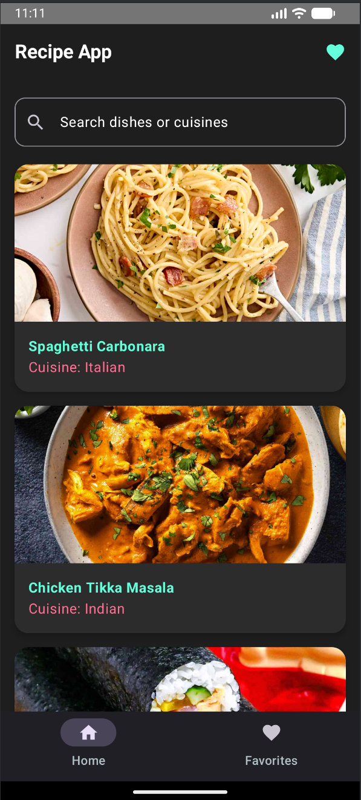
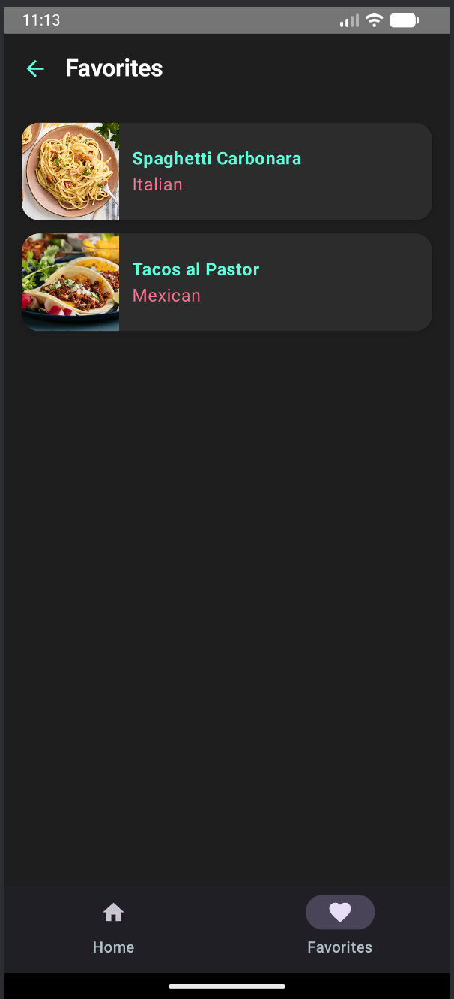
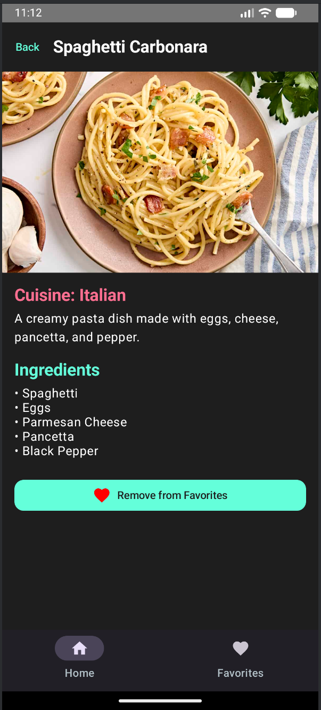
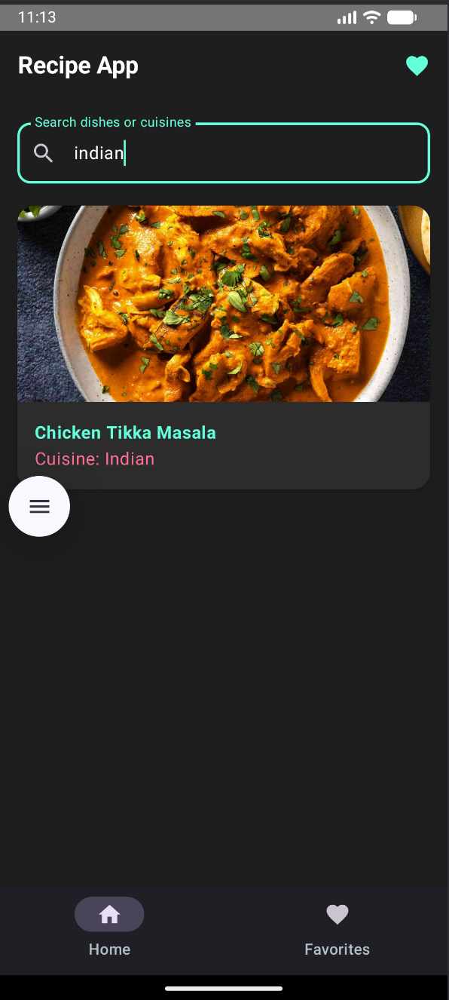

# Recipe App

A modern Android Recipe App built with **Jetpack Compose** in **Kotlin**, featuring a clean dark theme and Indian recipes.

CPSC 411A - Midterm Project (Fall 2025)

---

## Features

- Browse a list of recipes
- Search recipes by name or cuisine
- Favorite your preferred recipes
- View recipe details with ingredients
- Dark mode UI with elegant cards and typography

---

## Screenshots

### Home Screen

### Favorites Screen

### Details Screen

### Searching Recipes

---

## Demo Video

Click the thumbnail to watch the app in action.
